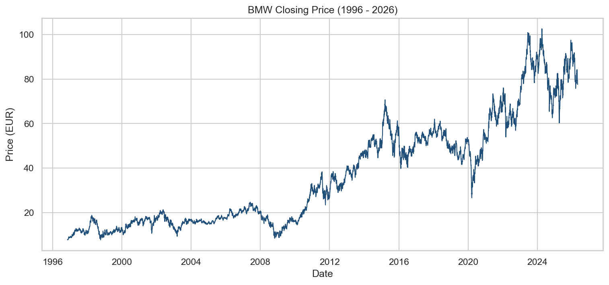
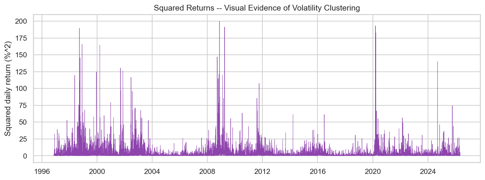
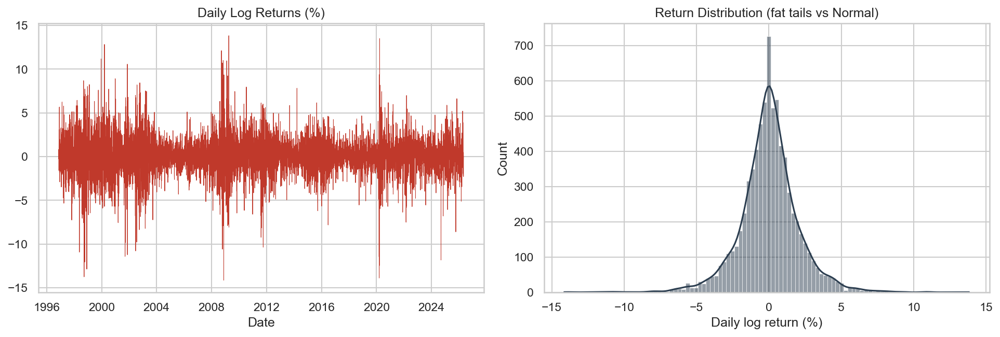

# BMW Stock — Volatility & Risk Modeling (GARCH Family)

[](https://bmw-volatility-risk-analysis.streamlit.app/)
[](https://www.python.org/)
[](LICENSE)

**[Live Dashboard →](https://bmw-volatility-risk-analysis.streamlit.app/)**

A volatility forecasting and risk management project on BMW daily stock data (1996–2026), built around the GARCH model family — the industry-standard approach used by risk desks, quant teams, and treasury/derivatives desks to forecast volatility and estimate Value-at-Risk (VaR).

Unlike price-forecasting projects (ARIMA/Prophet), this project answers a different and arguably more practically important question: **how risky is this asset going to be, and how much could I lose in a day?**



## Why this project is industry-relevant

- **GARCH models are the actual standard** used in bank risk departments, hedge funds, and treasury/derivatives desks to forecast volatility and feed into regulatory capital calculations under the Basel III market risk framework.
- **Value-at-Risk (VaR) and Expected Shortfall (ES)** are the metrics risk committees and regulators report on daily — VaR answers "how much could I lose," ES answers "how bad is it when I do."
- **Backtesting with Kupiec's Proportion-of-Failures test** is the same statistical validation regulators require before a bank can use an internal VaR model for capital purposes — this project doesn't just produce numbers, it proves they're statistically sound.

## Key results

| Metric | Value |
|---|---|
| Data range | 1996-11-08 to 2026-04-30 (7,548 trading days) |
| Annualized volatility | 33.42% |
| Excess kurtosis (fat tails) | 4.64 (confirms non-normal returns) |
| Best model (by AIC) | EGARCH(1,1,1) |
| 1-day 95% VaR | 2.03% of position value |
| 1-day 99% VaR | 3.28% of position value |
| 1-day 95% Expected Shortfall | 2.83% |
| Backtest breach rate (expected 5.0%) | 5.03% — model passes Kupiec test (p = 0.96) |

The EGARCH model outperformed standard GARCH and GJR-GARCH on both AIC and BIC, and the resulting VaR model passed its own statistical backtest — meaning the predicted risk levels matched real-world outcomes almost exactly over a 1,133-day held-out test period.

<details>
<summary>View supporting EDA plots</summary>

**Volatility clustering** — squared returns showing the visual justification for GARCH modeling:


**Return distribution** — fat tails relative to a normal distribution:


</details>

## Live dashboard

The project is deployed as an interactive Streamlit app: **[bmw-volatility-risk-analysis.streamlit.app](https://bmw-volatility-risk-analysis.streamlit.app/)**

Features:
- Switch between GARCH(1,1), GJR-GARCH(1,1,1), and EGARCH(1,1,1) live
- Adjust VaR confidence level (90–99%) with a slider
- Adjust forecast horizon (5–60 days)
- View price history, conditional volatility, forward volatility forecast, and model comparison (AIC/BIC) in real time

## Project structure

```
bmw-volatility-risk/
├── data/
│   └── bmw.csv                  # Daily OHLCV data
├── src/
│   ├── data_loader.py           # Load & validate data
│   ├── returns.py                # Log returns, realized vol, train/test split
│   ├── eda.py                    # EDA: stylized facts, stationarity, plots
│   ├── garch_models.py           # GARCH / GJR-GARCH / EGARCH fitting & forecasting
│   ├── risk_metrics.py           # Parametric VaR & Expected Shortfall
│   └── backtesting.py            # Kupiec POF backtest
├── dashboard/
│   └── app.py                    # Interactive Streamlit dashboard
├── outputs/
│   ├── figures/                  # Saved EDA plots
│   └── results/                  # Model comparison, forecasts, summary.json
├── main.py                       # Full pipeline (run this first)
├── requirements.txt
└── README.md
```

## Methodology

1. **EDA & stylized facts** — confirm the data shows the textbook properties of financial returns: volatility clustering, fat tails (excess kurtosis), and stationarity (ADF test) — the justification for using a GARCH model in the first place.
2. **Model fitting** — fit three GARCH-family models with Student-t errors (to account for fat tails):
   - GARCH(1,1) — symmetric baseline
   - GJR-GARCH(1,1,1) — captures the leverage effect (bad news increases volatility more than good news)
   - EGARCH(1,1,1) — log-variance specification, also asymmetric
3. **Model selection** — compare via AIC/BIC, select the best fit.
4. **Volatility forecasting** — forecast conditional volatility forward (Monte Carlo simulation for EGARCH, since it has no closed-form multi-step forecast).
5. **Risk metrics** — convert volatility forecasts into 1-day VaR and Expected Shortfall at 95%/99% confidence, using the Student-t distribution to stay consistent with the fitted model.
6. **Backtesting** — hold out the most recent ~15% of data, generate rolling VaR forecasts, count breaches, and run Kupiec's Proportion-of-Failures test to validate the model statistically (the same test regulators use).

## How to run locally

See **[SETUP_INSTRUCTIONS.md](SETUP_INSTRUCTIONS.md)** for full step-by-step VS Code + GitHub instructions.

Quick version:

```bash
git clone https://github.com/shiv-speccc/BMW-volatility-risk-analysis.git
cd BMW-volatility-risk-analysis
pip install -r requirements.txt
python main.py                      # runs full pipeline, saves results
streamlit run dashboard/app.py      # launches interactive dashboard
```

## Tech stack

Python · pandas · NumPy · [`arch`](https://arch.readthedocs.io/) (GARCH models) · statsmodels · SciPy · Streamlit · Plotly · Matplotlib/Seaborn

## Limitations & honest notes

- VaR backtesting here uses a static conditional-volatility approach for clarity rather than a full walk-forward re-estimation at every step (which would be the production-grade approach but is far more compute-intensive). This is noted as a possible extension.
- Parametric VaR assumes the fitted Student-t distribution holds going forward — historical simulation or Monte Carlo VaR would be reasonable extensions.
- Past volatility patterns are not guaranteed to hold in future regimes (model risk applies to every volatility model, including the ones used by real banks).

## Possible extensions

- Walk-forward (rolling) backtesting instead of a static fit
- Multi-asset portfolio VaR with a DCC-GARCH correlation model
- Historical simulation and Monte Carlo VaR for comparison against the parametric approach
- Realized volatility (high-frequency) models as a benchmark

## Author

**Shivarchan Coomaran** — B.Tech CSE (Data Science), JAIN University
[GitHub](https://github.com/shiv-speccc) · [LinkedIn](https://linkedin.com/in/shivarchan-coomaran-b47b14293)
